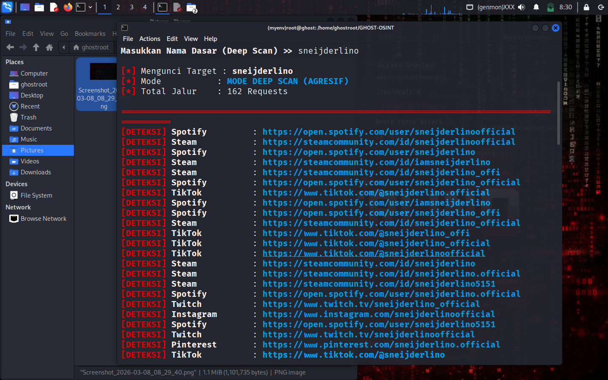
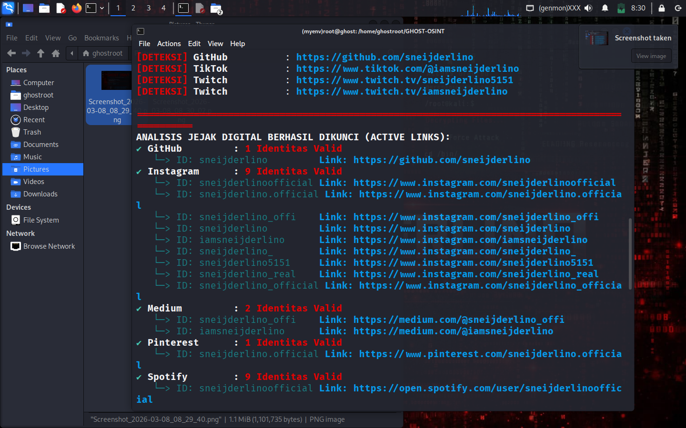

<p align="center">
  
</p>

# 👻 Ghost-OSINT v0.1

_Tool pencarian jejak digital multiguna untuk profesional keamanan siber_

[](LICENSE)
[](https://www.python.org/)
[](https://github.com/Sneijderlino/Ghost-Osint-V.0/stargazers)
[](https://github.com/Sneijderlino/Ghost-Osint-V.0/network/members)


[](https://git.io/typing-svg)

```
 ██████╗ ██╗  ██╗ ██████╗ ███████╗████████╗     ██████╗ ███████╗██╗███╗   ██╗████████╗
 ██╔════╝ ██║  ██║██╔═══██╗██╔════╝╚══██╔══╝    ██╔═══██╗██╔════╝██║████╗  ██║╚══██╔══╝
 ██║  ███╗███████║██║   ██║███████╗   ██║       ██║   ██║███████╗██║██╔██╗ ██║   ██║
 ██║   ██║██╔══██║██║   ██║╚════██║   ██║       ██║   ██║╚════██║██║██║╚██╗██║   ██║
 ╚██████╔╝██║  ██║╚██████╔╝███████║   ██║       ╚██████╔╝███████║██║██║ ╚████║   ██║
  ╚═════╝ ╚═╝  ╚═╝ ╚═════╝ ╚══════╝   ╚═╝        ╚═════╝ ╚══════╝╚═╝╚═╝  ╚═══╝   ╚═╝
```

<p align="center">
  <a href="#table-of-contents"></a>
</p>

## 📋 Table of Contents

1. [Deskripsi Project](#deskripsi-project)
2. [Fitur Utama](#fitur-utama)
3. [Preview Tool](#preview-tool)
4. [Struktur Folder](#struktur-folder)
5. [Tech Stack](#tech-stack)
6. [Cara Instalasi](#cara-instalasi)
   - [Windows](#windows)
   - [Kali Linux](#kali-linux)
   - [Termux](#termux)
7. [Cara Menjalankan Program](#cara-menjalankan-program)
8. [Dependencies](#dependencies)
9. [Contoh Penggunaan](#contoh-penggunaan)
10. [Warning / Disclaimer](#warning--disclaimer)
11. [Kontribusi](#kontribusi)
12. [Lisensi](#lisensi)
13. [Kontak Developer](#kontak-developer)

---

## 🔍 Deskripsi Project

Ghost-OSINT adalah kumpulan skrip Python untuk melakukan _open source intelligence_ (OSINT) khususnya pencarian akun/jejak digital di berbagai platform. Dikembangkan dengan estetika hitam-merah ala dunia peretasan, tool ini ditujukan bagi pentester, threat hunter, dan penggiat keamanan siber yang membutuhkan alat ringan, asinkron, dan mudah dikembangkan.

Script utama (`Ghost-Osint.py`) melakukan pemindaian baik cepat maupun agresif menggunakan basis data URL (.json) untuk menemukan akun target.

## ⚙️ Fitur Utama Tool

- 🕵️‍♂️ Mode _Deep Scan_ dengan mutasi nama agresif
- ⚡ Mode _Quick Scan_ (nama inti saja)
- 🔁 Dukungan multiple database JSON
- 🧠 UI terminal berwarna (hitam-merah) untuk suasana hacking
- 📊 Output terstruktur untuk hasil valid
- 💾 Cadangan/ekspor data hasil pencarian

## 🖼️ Preview Tool




## 🧪 Tech Stack


- kode Python asinkron
- basis data URL dalam format JSON

## 📁 Struktur Folder Project

```
Ghost-Osint-V.0/
├── Ghost-Osint.py        # script utama
├── data.json             # contoh database
├── dataBase.json         # contoh lain
├── Data-Base-Public.json # backup publik
├── img/
│   └── sampel.png        # preview image (ganti dengan gambar asli)
├── README.md             # file ini
├── requirements.txt      # dependensi Python
├── LICENSE               # lisensi MIT
└── .gitignore            # pengecualian Git
```

---

## 🛠️ Cara Instalasi

### 📌 Windows

1. Unduh dan instal [Python 3.8+](https://www.python.org/downloads/) (centang "Add to PATH").
2. Buka _Command Prompt_ atau _PowerShell_.
3. Clone repository:
   ```bash
   git clone https://github.com/Sneijderlino/Ghost-Osint-V.0.git
   cd Ghost-Osint-V.0
   ```
4. (Opsional) buat virtual environment:
   ```bash
   python -m venv venv
   venv\Scripts\activate
   ```
5. Install dependensi:
   ```bash
   pip install -r requirements.txt
   ```
6. Jalankan program (lihat bagian selanjutnya).

### 🐧 Kali Linux

```bash
sudo apt update && sudo apt upgrade -y
git clone https://github.com/Sneijderlino/Ghost-Osint-V.0.git
cd Ghost-Osint-V.0
sudo apt install python3 python3-pip -y
pip3 install -r requirements.txt
```

### 📱 Termux

```bash
pkg update && pkg upgrade -y
pkg install git python -y
git clone https://github.com/Sneijderlino/Ghost-Osint-V.0.git
cd Ghost-Osint-V.0
pip install -r requirements.txt
```

> Pastikan perangkat Anda mendukung Python dan akses jaringan.

---

## ▶️ Cara Menjalankan Program

Dari terminal dalam folder proyek:

```bash
python Ghost-Osint.py
```

Pada Linux/Termux gunakan `python3` jika diperlukan.

Ikuti petunjuk menu yang muncul untuk memilih mode scan atau mengganti database.

---

## 📦 Dependencies

- `aiohttp` (untuk permintaan HTTP asinkron)
- Python 3.8 atau lebih tinggi

Dependencies tertulis di [requirements.txt](requirements.txt).

---

## 💻 Contoh Penggunaan

1. Jalankan program.
2. Pilih `01` untuk Deep Scan atau `02` untuk Quick Scan.
3. Masukkan nama target, mis. `john_doe`.
4. Tunggu hingga proses selesai dan lihat hasil.

```text
[STATUS] Active DB: data.json
[01] Deep Scan  (Dengan Variasi/Mutasi Nama)
> 01
Masukkan Nama Dasar (Deep Scan) >> john_doe
...
✔ twitter.com     : https://twitter.com/john_doe
✔ github.com      : https://github.com/johndoe
Total: 2 jejak digital berhasil dikunci.
```

---

## ⚠️ Warning / Disclaimer

Tool ini disediakan **tanpa jaminan**. Penggunaan untuk kegiatan ilegal atau tanpa izin adalah tanggung jawab pengguna. Penulis tidak bertanggung jawab atas konsekuensi hukum yang timbul.

Pengguna harus memastikan kegiatan OSINT dilakukan secara etis dan mematuhi hukum setempat.

---

## 🤝 Kontribusi

Kontribusi sangat dipersilakan! Untuk berkontribusi:

1. Fork repository
2. Buat branch baru (`feature/nama-fitur`)
3. Commit perubahan dan buka _pull request_
4. Pastikan kode mudah dibaca dan terdokumentasi

Perbaikan bugs, penambahan modul, atau database URL baru sangat dihargai.

---

## 📜 Lisensi

Proyek ini dirilis di bawah lisensi [MIT](LICENSE).

---

## 📬 Kontak Developer

- GitHub: [@Sneijderlino](https://github.com/Sneijderlino)
- Email: `sneijderlino@example.com`

Selamat menjelajah jejak digital bersama Ghost-OSINT! 👻
# Ghost-Osint-V.0
